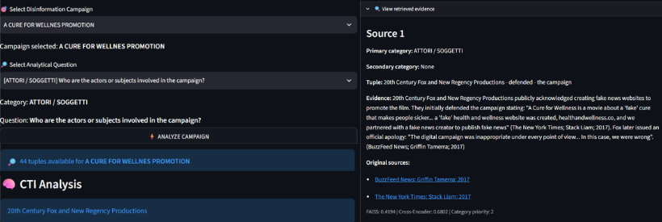

# CTI Analysis Interface

This directory contains the Streamlit application developed to explore the CTI knowledge extracted from the FakeCTI dataset.

The interface allows the user to select a disinformation campaign and an analytical question associated with one of the nine CTI categories. Relevant tuples are retrieved from the selected campaign, reranked according to semantic relevance and category information, and provided to Mistral-Nemo to generate a grounded CTI analysis.

## Interface



## Directory Structure

```text
src/interface/
├── README.md
├── app.py
└── example.png
```

## Files

### `app.py`

Contains the complete Streamlit application.

The application:

- loads the FakeCTI dataset, the extracted CTI tuples, and the source-to-link mapping;
- loads the embedding model, Cross-Encoder, and Mistral-Nemo;
- constructs a semantic representation of each CTI tuple;
- allows the user to select a disinformation campaign;
- allows the user to select one of the nine predefined analytical questions;
- retrieves relevant tuples within the selected campaign;
- reranks the retrieved tuples using semantic relevance and category information;
- provides the selected evidence to Mistral-Nemo;
- displays the generated CTI analysis;
- displays the retrieved tuples, evidence, retrieval scores, and available links to the original sources.

### `example.png`

Contains an example of the Streamlit interface and its output.

## Input Data

The application uses the following files from the repository:

```text
data/
├── FakeCTI.csv
└── interface/
    ├── CTI_Tuples.xlsx
    └── Evidence_Sources.xlsx
```

### `FakeCTI.csv`

Contains the complete FakeCTI dataset used by the project.

The file is shared with the other modules of the repository and is therefore not duplicated inside `data/interface/`.

### `CTI_Tuples.xlsx`

Contains the CTI tuples used as the knowledge base of the interface.

For each tuple, the application uses:

- campaign;
- evidence;
- primary analytical category;
- secondary analytical category, when available;
- subject–relation–object tuple.

### `Evidence_Sources.xlsx`

Contains the mapping between evidence sources and their original links.

The application uses this file to display the available original sources associated with the retrieved evidence.

## Analysis Workflow

The interface follows a retrieval and generation workflow based on the selected campaign and analytical question.

### 1. Campaign Selection

The user selects a disinformation campaign.

Only tuples belonging to the selected campaign are considered during retrieval.

### 2. Analytical Question Selection

The user selects one of nine predefined analytical questions corresponding to the CTI categories used in the project.

The selected category is used as a ranking signal and as the analytical dimension that the generated answer must address.

### 3. FAISS Retrieval

Each tuple is represented using:

```text
all-MiniLM-L6-v2
```

The embedding is constructed from the subject, relation, and object of the tuple.

The selected analytical question is embedded using the same model, and FAISS retrieves the top 10 semantically similar tuples within the selected campaign.

### 4. Cross-Encoder Reranking

The retrieved tuples are reranked using:

```text
cross-encoder/ms-marco-MiniLM-L-6-v2
```

The Cross-Encoder evaluates the semantic relevance between the selected analytical question and each retrieved tuple.

### 5. Category-Aware Ranking

Category information is used as an additional ranking signal.

The retrieved tuples receive the following priority:

```text
Primary category match   → 2
Secondary category match → 1
Other category           → 0
```

The category is not used as a hard filter. Tuples from other categories remain available when they provide relevant information for the selected analytical question.

The candidates are ordered first by category priority and, within the same priority level, by Cross-Encoder score. The top 5 tuples are then selected as grounding context.

### 6. CTI Analysis Generation

The top 5 retrieved tuples and their associated evidence are provided to Mistral-Nemo together with:

- the selected campaign;
- the selected analytical category;
- the category definition;
- the analytical question.

The model is instructed to use only the retrieved information, avoid unsupported inferences, and focus the answer on the requested analytical dimension.

If the retrieved information is insufficient, the model returns:

```text
Not enough information.
```

### 7. Evidence Visualization

The interface displays the generated CTI analysis and allows the user to inspect the retrieved evidence.

For each retrieved item, the interface shows:

- primary category;
- secondary category, when available;
- subject–relation–object tuple;
- supporting evidence;
- available links to the original sources;
- FAISS similarity score;
- Cross-Encoder score;
- category priority.

## Models

### all-MiniLM-L6-v2

The semantic retrieval stage uses:

```text
all-MiniLM-L6-v2
```

The model is loaded automatically through `sentence-transformers` and does not need to be manually placed in the repository.

Model:

https://huggingface.co/sentence-transformers/all-MiniLM-L6-v2

### Cross-Encoder

The reranking stage uses:

```text
cross-encoder/ms-marco-MiniLM-L-6-v2
```

The model is loaded automatically through `sentence-transformers` and does not need to be manually placed in the repository.

Model:

https://huggingface.co/cross-encoder/ms-marco-MiniLM-L-6-v2

### Mistral-Nemo

The CTI analysis generation stage uses:

```text
Mistral-Nemo-Instruct-2407-Q4_K_S.gguf
```

Download:

https://huggingface.co/mradermacher/Mistral-Nemo-Instruct-2407-GGUF

Place the downloaded file in:

```text
src/interface/
```

so that the final path is:

```text
src/interface/Mistral-Nemo-Instruct-2407-Q4_K_S.gguf
```

## Dependencies

The main Python dependencies are:

```text
streamlit
pandas
numpy
faiss-cpu
sentence-transformers
llama-cpp-python
openpyxl
```

## Execution

From the repository root, run:

```bash
streamlit run src/interface/app.py
```

The Streamlit application will load the required datasets and models and open the CTI analysis interface.